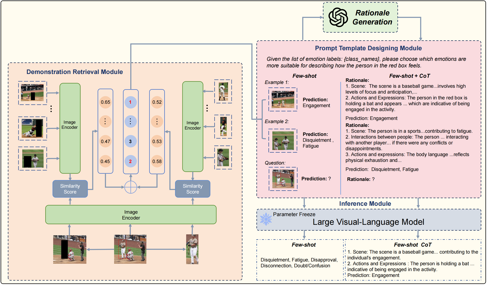

## Abstract
Context-aware emotion recognition (CAER) is a complex and significant task that requires perceiving emotions from various contextual cues. Previous approaches primarily focus on designing sophisticated architectures to extract emotional cues from images. However, their knowledge is confined to specific training datasets and may reflect the subjective emotional biases of the annotators. Furthermore, acquiring large amounts of labeled data is often challenging in real-world applications. In this paper, we systematically explore the potential of leveraging Large Vision-Language Models (LVLMs) to empower the CAER task from three paradigms: (1) We fine-tune LVLMs on two CAER datasets, which is the most common way to transfer large models to downstream tasks. (2) We design zero-shot and few-shot patterns to evaluate the performance of LVLMs in scenarios with limited data or even completely unseen. In this case, a training-free framework is proposed to fully exploit the In-Context Learning (ICL) capabilities of LVLMs. Specifically, we develop an image similarity-based ranking algorithm to retrieve examples; subsequently, the instructions, retrieved examples, and the test example are combined to feed LVLMs to obtain the corresponding sentiment judgment. (3) To leverage the rich knowledge base of LVLMs, we incorporate Chain-of-Thought (CoT) into our framework to enhance the model’s reasoning ability and provide interpretable results. Extensive experiments and analyses demonstrate that LVLMs achieve competitive performance in the CAER task across different paradigms. Notably, the superior performance in few-shot settings indicates the feasibility of LVLMs for accomplishing specific tasks without extensive training.

## Installation

```bash
./environment_setup.sh
```

or follow the instructions below in order.

```
# Create a conda environment
conda create -n caer python=3.10 -y # make sure you install python 3.10
conda activate caer

# install requirements
pip install --upgrade pip  # enable PEP 660 support
# this is optional if you prefer to system built-in nvcc.
conda install -c nvidia cuda-toolkit -y
wget https://github.com/Dao-AILab/flash-attention/releases/download/v2.4.2/flash_attn-2.4.2+cu118torch2.0cxx11abiFALSE-cp310-cp310-linux_x86_64.whl
pip install flash_attn-2.4.2+cu118torch2.0cxx11abiFALSE-cp310-cp310-linux_x86_64.whl
pip install -e .
pip install -e ".[train]"

pip install git+https://github.com/huggingface/transformers@v4.36.2
site_pkg_path=$(python -c 'import site; print(site.getsitepackages()[0])')
cp -rv ./llava/train/transformers_replace/* $site_pkg_path/transformers/
```

## Dataset
For convenience, we have provided the pre-split test.csv file. The original data needs to be downloaded by the user.

Download HECO and EMOTIC raw image and put them in /dataset/Emotic/emotic and /dataset/HECO/Data

EMOTIC: https://s3.sunai.uoc.edu/emotic/index.html

HECO: https://heco2022.github.io/

The dataset folder should be structured as follows:
```sh
Emotic # the downloaded v2xset data
  —— Annotations
  ── emotic
    —— ade20k
    —— emodb_small
    —— framesdb
    —— mscoco
  ── test.csv
HECO # the downloaded opv2v data
  ── Data
  ── test.csv
```

## Model weight
Down load model and put it in /weight_base

VILA-8B :https://huggingface.co/Efficient-Large-Model/Llama-3-VILA1.5-8B/tree/main

## Inference

Demonstration base at /sample_base, the file include the rationale generated by GPT4


step 1: retrieve demonstration (This will take some time because we need to search for the best demonstration for each test sample. We also provide the results after retrieving each image.)
```sh
 python similarity_image.py 
```
Generate a csv file in /dataset/emotic(heco)_testdata_with_examples.csv (already provide at /dataset)

step 2: start batch inference
```sh
 python run.py
 ```
and the results will be saved in /results

## Large Vision-Language Models as Emotion Recognizers in Context Awareness



## Acknowledgement
We are aware that our works are inspired by the following works, including but not limited to
* LLaVA: [https://github.com/haotian-liu/LLaVA](https://github.com/haotian-liu/LLaVA)
* VILA: [https://github.com/NVlabs/VILA](https://github.com/NVlabs/VILA)

Without these, nothing could happen in this repository.

 ## Citation
If you are using our PediatricsGPT for your research, please cite the following paper:
 ```bibtex
@article{lei2024large,
  title={Large vision-language models as emotion recognizers in context awareness},
  author={Lei, Yuxuan and Yang, Dingkang and Chen, Zhaoyu and Chen, Jiawei and Zhai, Peng and Zhang, Lihua},
  journal={arXiv preprint arXiv:2407.11300},
  year={2024}
}